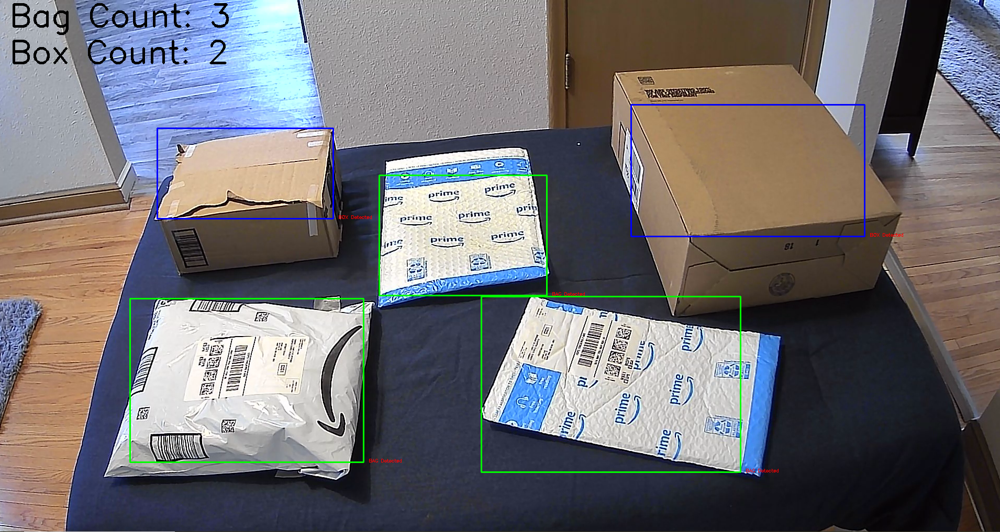

# Single Camera Based Package Counting

## Applications

Understanding how many products are present at a location within a given logistics facility has several applicable use cases. For one, if you know how many products are upstream of a given location, you can plan your future state accordingly (such as shift planning for labor, updating timelines for outbound trucks and planes, etc). Secondly, locations that are full of product, but un(der)staffed, serve as an indication that help is needed. Lastly, but not limited to, is understanding if the amount of product at a given location is increasing, decreasing, or remaining constant since this provides a means to forecast if that location is (or will soon be) a bottleneck for material flow.


## Scope

### Limits

This is a very broad problem that is most commonly referred to as ‘counting’ in the visual interfaces research community. As such, it's important to clarify the limitations and focus of this proposal. For starters, this problem could alternatively be solved without using a visual interface. Such alternatives include a human or a differing hardware (such as a [_Cognex scanner_](https://www.cognex.com/products/barcode-readers)) performing the ‘counting’. This proposal is limited to exploring ‘counting’ techniques in the logistics domain via a single camera based visual interface. Additional limitations are also placed upon the variation of the ‘product’ given the expansive scope of the problem space. This is an important limitation given that any generic ‘product’ within a logistics facility could range from machine parts to newspapers. Therefore, the scope of the proposal is limited to counting packages of varying size as they enter and leave a given location. The domain for this project will be a household setting (such a tabletop or hardwood floor) given the relative ease of domain engineering this provides for the project.

### Problem Statement

The ability to count the number of packages of varying sizes types present on a tabletop in near real time via a single camera. In this case, a package will be either a cardboard box or a bag.

### What Makes This Problem Difficult

Multiple packages may enter the domain at the same time making it difficult to discern the count. Large packages may also enter the location and obscure the view of smaller packages that lie behind them from the point of view of the camera. Additionally, the natural similarity of the ‘product’ in this case may provide a means to segment the visual input by color more readily - but it also makes it more difficult to segment packages apart from one another.

### Existing Research + Literature

There has been extensive research done in the fields of object recognition and object tracking over the past few decades. When it comes to real-time object counting generally speaking, there is an existing research basis for counting people via a single camera (Kim et al.) as well as counting vehicles via multiple cameras (Ciampi et al.). Existing literature also exists surrounding object recognition and counting specific to industrial settings via “smart cameras” (Lee & Yang) as well as single board microprocessors (Solak & Bolat). Both Lee & Yang and Solak & Bolat make reference to counting on conveyor belts and production lines which falls to a similar (though larger) scope to that of this proposal. The aforementioned research areas use a range of visual interface counting techniques ranging from edge detection to deep learning. This proposal will be focused on using fundamental object recognition techniques such as blurring, color segmentation, edge detection, etc.

### Evaluating Success

Our evaluation metric in this case is whether the system correctly counts the number of packages on the tabletop. While this is easy to measure, it is difficult to concisely define “success” given the edge cases previously defined (see ‘What Makes This Problem Difficult’). That being said, acceptable performance for this project will be designing a system that can correctly count “visible” packages on a tabletop. “Visible” in this case means packages that are visible from the viewpoint of the camera (and not _completely_ obscured by other packages). Additionally, acceptable performance includes the count being updated in real time as packages move in and out of the domain (the tabletop in this case). We will run between 10-20 trials that include the following variability:

- Type (a mixture of boxes + bags)
- Sparseness (number of packages range from 1 to many)
- Location (packages are placed in varying locations across the tabletop)
- Size (packages of varying sizes)

Through iteration of these test scenarios, we can expect to learn what the system is “lacking”. For example, if the system fails to count packages of varying locations correctly, it may be related to the domain engineering (such as camera placement, lighting, etc). Additionally, if the system fails to properly count packages that are “near each other” we may need to further iterate on the blob and contour detection settings used by the system.

Stretch goals for this system include being able to keep an accurate count of packages as sparseness decreases to the point of “completely obscuring visibility” and appropriately counting packages that are “connected” (packages that are touching and almost appear to be a single entity that is).

## Design

### High Level Design


Above we have depicted the tabletop, incoming and outgoing queue of packages, and camera that will be capturing the domain. The camera will feed the real time video that is captured from the domain to the counting system.

### Domain Engineering

I setup my apartment to be the testing space for this project given the ease of use it provided. A holistic view of the setup can be seen below:


A couple of important notes about this setup. First of all, I ended up placing a dark colored blanket over my tabletop because my kitchen table was a _very_ similar color to the cardboard boxes I was trying to detect (and it gave a good contrast to the brown boxes and white bags the system was trying to track).

Secondly, the hardwood floor (in the background) does have a fairly similar color to the cardboard boxes I was trying to detect on the tabletop — but I was able to work around having to place a sheet/blanket on the floor (more details on this to come in further sections).

Of additional note is the camera placement in my domain. I had originally taped the camera to the ceiling but ran into issues with getting the tape to stay in place to ended up opting for something sturdier — which resulted in the setup seen on right. I took a chair, taped a broomball stick to it, and then strapped my webcam to the top of it such that the camera was facing downward at an angle towards the tabletop.

This provided my system with a “birds eye view” of the tabletop and granted a semi-perspective of the length, width, and height of associated packages.

### Video Analysis

The first thing the system does is read in the live video feed from the web camera (that is capturing the domain) and feeds that to my computer and subsequent system. From here, the video feed goes through several “algorithms” as each frame of the video feed is consumed. This goes as follows:

#### 1. Tabletop Mask

As alluded to above, the first thing I noticed when testing my initial system was that the system kept picking up objects/connected-components that looked very similar to cardboard boxes on the periphery of the video feed. This was because the hardwood floor had a very similar hue of brown to that of the cardboard boxes. Thereby, I introduced a “tabletop mask” to the video feed that essentially “zooms in” on the tabletop and reduces the size of the window we consider when looking for packages to that of where the tabletop is located relative to the camera.

|              _Before Mask_               |              _After Mask_              |
| :--------------------------------------: | :------------------------------------: |
|  |  |

As you can see in the images above, the area outside the tabletop has been masked and pixels set to 0 (the color black).

#### 2. Foreground vs Background Detection

Once we have the masked frame (such that we are focused in on the tabletop) we then perform foreground vs background detection for both bags and boxes.

**_Bag_**
We start by converting the input frame to HSV color space which makes it easier to discern the color white. Then, we apply a mask such that pixels with _minimal_ white intermixed are masked. The result looks something like this:


**_Box_**
For boxes, we start by converting the tabletop masked frame to the HSV color space. We then apply a threshold such that anything with a color at-or-near brown is retained. The result looks something like this:


#### 3. Connected Component Analysis

We then pass the above masked frames (there is one with bags and another with boxes brought to the foreground) to a connected component analysis algorithm. This process does a few things:

1. Use the OpenCV library’s _Connected Component With Stats_ method to fetch the connected components within each masked frame and their associated statistics
2. Filter out any connected component that is too small to be a package (bag or box)
   1. We use the total area of the frame and area of each connected component to filter out any connected component that’s area is less than 1.5% of the total frame area
3. The remaining connected components represent out “actual” boxes and bags in the frame

And the resulting connected components with statistics that represent our bags and boxes look like:

```
`// example bag connected component`
`{`
`   ``'leftmost_x'``:`` ``383``,`` `
`   ``'rightmost_x'``:`` ``838``,`` `
`   ``'top_y'``:`` ``280``,`` `
`   ``'bottom_y'``:`` ``27``,`` `
`   ``'width'``:`` ``455``,`` `
`   ``'height'``:`` ``253``,`` `
`   ``'area'``:`` ``67869``,`` `
`   ``'centroid'``:`` array``([``621.73090807``,`` ``389.39156316``])`
`}`

`// example box connected component
{
   'leftmost_x': 1020,
   'rightmost_x': 1600,
   'top_y': 297,
   'bottom_y': -171,
   'width': 580,
   'height': 468,
   'area': 163586,
   'centroid': array([1324.62947318,  477.37299035])
}
`
```

### Output & User Interface

Once we’ve detected our bags and boxes, we want to show the user what we’ve detected as well as where its being detected (for both ease of use and troubleshooting purposes). The process for outlining detected packages is as follows:

1. Convert the masked bag + box frame to the grayscale color space
2. Apply thresholds depending on whether its a bag or box frame (aka white or brown color we are looking for)
3. Use OpenCV’s _Find Contours_ algorithm to find the bounding rectangle around our packages
4. Apply bounding rectangle and indicative text around the detected package

The output looks something like this:


## Evaluation

### Evaluating Results

#### Evaluation Metric

Correctly counting the number of packages on a tabletop by type.

#### Results

_What the System Does Well_

- Foreground + background detection
- Identifying & outlining _rough_ areas in the frame where packages were located
- Counting packages that had _concise_ object boundaries

_What the System Does Poorly_

- Outlining the _entire_ package in the output interface
- Handling packages of mixed colors
  - Below we can see a box that has a black label in the middle
- Handling packages with varying “value”
  - When the light source is overhead, a cardboard box has a wide range of value depending on if the system is evaluating the "top or sides for instance
- Identifying packages with shared edges

#### Future Enhancements

In the existing implementation, the system does a simple color mask as it looks for white and brown (depending on the type of package we are looking for). This doesn’t handle cases of packages with mixed colors very well (such as bags mixed with the color blue and boxes with different colored labels taped on). One future enhancement would be to “unmask” the identified packages after they’ve passed through the blob detection algorithm and before drawing contours. This way, non-mask colors (such as blue for bags and black for boxes) would be present when the system finds contours and draws outlines.

The other major case the system lacks handling for is when there are stacked/overlapping packages. To handle this properly, the system would need to be enhanced with a texture segmentation method (or something similar) such that these packages could be discerned even is stacked atop one another.

## Discussion + Reflection

**_Good domain engineering solves many problems_**

- Placement of camera(s)
- External light sources
- Foreground & background colors/texture/distance

**_Straightforward techniques vs machine learning_**

- Always used to think computer vision problems were solved with ML models
- Color segmentation + texture + what/where/how gets us pretty close in a consistent system

**_Designing a system that fits your domain (and vice versa)_**

- Lots of the “thresholds” implemented in the system are there due to the domain we are capturing
- Finding a “happy medium” is a combination of hard coding a system and tweaking domain

## Code Packages + Algorithms Used

1. OpenCV
   1. Threshold — [Source](https://docs.opencv.org/4.x/d7/d1b/group__imgproc__misc.html#gae8a4a146d1ca78c626a53577199e9c57)
   2. Connected Component With Stats → [Source](https://docs.opencv.org/3.4/d3/dc0/group__imgproc__shape.html#ga107a78bf7cd25dec05fb4dfc5c9e765f)
   3. Find Contours → [Source](https://docs.opencv.org/3.4/d3/dc0/group__imgproc__shape.html#ga17ed9f5d79ae97bd4c7cf18403e1689a)

## References

1. Kim, Jae-Won, et al. "Real-time system for counting the number of passing people using a single camera." _Pattern Recognition: 25th DAGM Symposium, Magdeburg, Germany, September 10-12, 2003. Proceedings 25_. Springer Berlin Heidelberg, 2003.
2. Ciampi, Luca, et al. "Counting Vehicles with Cameras." _SEBD_. 2018.
3. Lee, Shih-Hsiung, and Chu-Sing Yang. "A real time object recognition and counting system for smart industrial camera sensor." _IEEE Sensors Journal_ 17.8 (2017): 2516-2523.
4. Solak, Serdar, and Emine Doğru Bolat. "Real time industrial application of single board computer based color detection system." _2013 8th International Conference on Electrical and Electronics Engineering (ELECO)_. IEEE, 2013.
